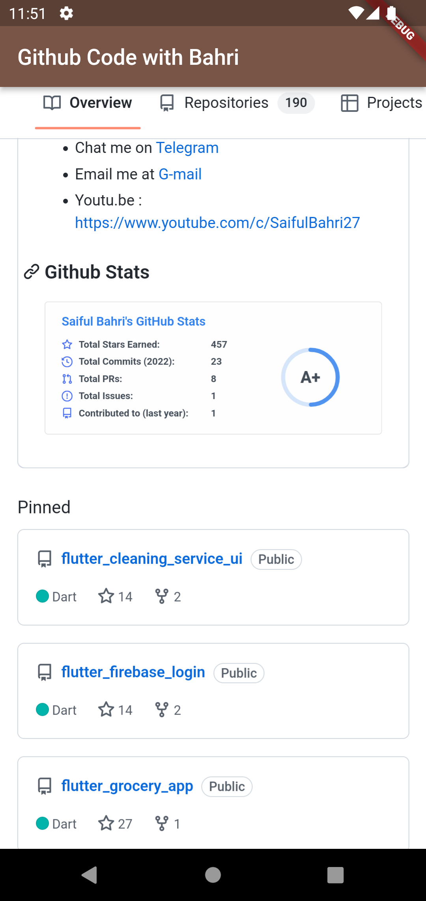

# Flutter Webview version 4.0

Easy to create webview with flutter

## Youtube Link

[](https://youtu.be/2eoPLQJwr8c)
https://youtu.be/2eoPLQJwr8c


## Playlist Flutter Intensive Club

https://www.youtube.com/playlist?list=PLQvQbJRJpIZ67MrVzPDOYtAs7wmFjmFUI (https://www.youtube.com/playlist?list=PLQvQbJRJpIZ67MrVzPDOYtAs7wmFjmFUI)

## Roadmap Learing Flutter by Flutter Intensive Club (FIC)

https://miro.com/app/board/uXjVPKAz1i4=/?share_link_id=218530192751 (https://miro.com/app/board/uXjVPKAz1i4=/?share_link_id=218530192751)


## ScreenShot

| picture 1         | picture 2           |
|--------------|----------------|
|  |       |

## Packages
* https://pub.dev/packages/webview_flutter

pubspec.yml
```
dependencies:
  cupertino_icons: ^1.0.2
  flutter:
    sdk: flutter
  webview_flutter: ^4.0.1
```  


## Contact:
* Consultation Flutter and Endorse https://t.me/bahri_bhe
* Youtube: https://youtube.com/@codewithbahri
* Github: https://github.com/bahrie127
* Linkedin: https://linkedin.com/in/bahrie
* Roadmap Flutter: https://youtu.be/e2zMJqDBmoY
* Medium: https://medium.com/@bahri